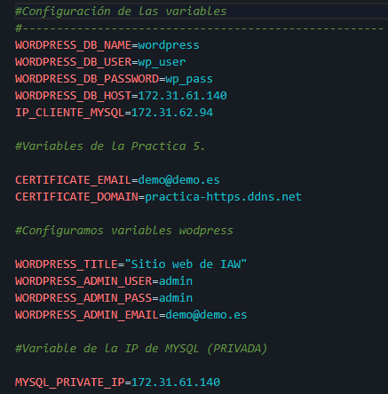
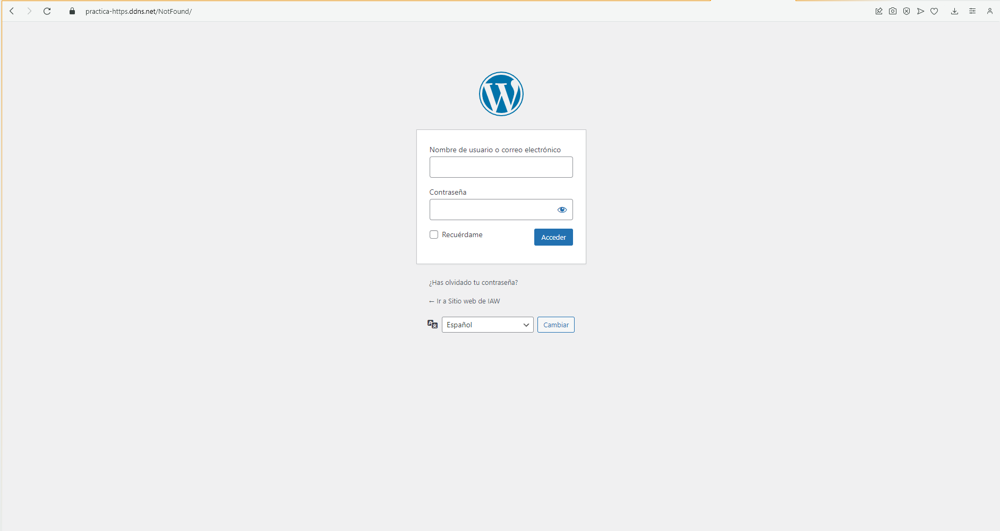

# Practica01-9IAW
Este repositorio es para la Práctica 1 apartado 9 de IAW. 

- La principal funcionalidad de esta práctica es que tenemos que automatizar la instalación y configuración de una aplicación web LAMP en dos máquinas virtuales.

    Vamos a tener dos *_pilas LAMP_* en dos máquinas diferentes, una se encargara de gestionar las peticiones web y la otra de gestionar la base de datos.

    La arquitectura de esta práctica estará formada de la siguiente manera:

    1. Una capa de *_front_end_*, que estará formada por un servidor web con Apache HTTP server.

    2. Una capa de *_back_end_* , que estará formada por un servidor MySQL.


## Partición de los scripts.

- Como hemos comentado anteriormente, haciendo uso del script que tenemos creado anteriormente *_install_lamp.sh_* tendremos que "partirlo" de manera que quede un apartado para la instalación de Apache2 en el *_front_end_* y la parte de la configuración de MySql en el *_back_end_*


    El script que tenemos que utilizar en el *_front_* para su correspondiente *_install_lamp_* será el siguiente:

    ```
    #!/bin/bash

    #Esto muestra todos los comandos que se van ejecutando
    set -x 
    #Actualizamos los repositorios
    apt update

    #Actualizamos los paquetes de la máquina 

    #apt upgrade -y

    # Instalamos el servidor web apache A.

    apt install apache2 -y

    # Instalamos PHP.

    sudo apt install php libapache2-mod-php php-mysql -y

    #Copiamos el directorio 000-default.conf (Archivo de configuración de apache2)

    cp ../conf/000-default.conf /etc/apache2/sites-available/000-default.conf

    # Instalamos PHP.

    sudo apt install php libapache2-mod-php php-mysql -y

    # Reiniciamos el servicio (apache)

    systemctl restart  apache2

    # Modificamos el propietario y el grupo del directorio /var/www/html

    chown -R www-data:www-data /var/www/html
            
    ```

    En este script podemos observar como movemos los archivos *_conf_* como hemos hecho anteriormente con otras prácticas como pueden ser: [Práctica 1.7 IAW](https://github.com/kinoibanez/Practica01-7IAW).

    La principal funcionalidad de este script en el *_front_* es instalar apache y configurarlo de manera correcta.

    


-  El script que tenemos que utilizar en el *_back_* para su correspondiente *_install_lamp_* será el siguiente:

    ```
    #!/bin/bash

    #Esto muestra todos los comandos que se van ejecutando
    set -x 
    #Actualizamos los repositorios
    apt update

    #Añadimos el source

    source .env

    #Actualizamos los paquetes de la máquina 

    #apt upgrade -y

    # Instalamos Mysql L.

    sudo apt install mysql-server -y

    #Configuramos MYSQL para que sólo acepte conexiones desde la IP privada

    sed -i "s/127.0.0.1/$MYSQL_PRIVATE_IP/" /etc/mysql/mysql.conf.d/mysqld.cnf


    #Creamos el usuario en MYSQL

    DROP USER IF EXISTS '$DB_USER'@'$FRONTEND_PRIVATE_IP';
    CREATE USER '$DB_USER'@'$FRONTEND_PRIVATE_IP' IDENTIFIED BY '$DB_PASS';
    GRANT ALL PRIVILEGES ON '$DB_NAME'.* TO '$DB_USER'@'$FRONTEND_PRIVATE_IP';

    #Reiniciamos el servicio de mysql

    systemctl restart mysql

    ```

    Como podemos observar en este script hemos declaro una variable nueva que anteriormente no hemos usado que es *_$MYSQL_PRIVATE_IP_*, la cual tenemos que tener configurada con la IP privada del servidor *_back_end_*.

### Archivo de configuración 000-default.conf, *_cerbot_* y .env.

- Este apartado contiene información como anteriormente hemos comentado, que ha sido utilizada en prácticas anteriores, pero siempre es bueno realizar un repaso.

    El archivo 000-default.conf que almacena la configuración de las conexiones de Apache en nuestra máquina tendra que estar de la siguiente manera: 

    ```
        <VirtualHost *:80>
    #ServerName www.example.com
    ServerAdmin webmaster@localhost
    DocumentRoot /var/www/html
    DirectoryIndex index.php index.html
    <Directory "/var/www/html">
        AllowOverride All
    </Directory>

    ErrorLog ${APACHE_LOG_DIR}/error.log
    CustomLog ${APACHE_LOG_DIR}/access.log combined
    </VirtualHost>
    ```

    Sentencias como *_ERRORLOG_* y *_CUSTOMLOG_* nos permitirán seguir una serie de registros de errores en la máquina.

- Tenemos que instalar cerbot para asi poder configurar la conexión y que sea segura, o que al menos accedamos siempre a través del puerto *_https:443_*, este script lo hemos usado en prácticas anteriores pero siempre es bueno tenerlo a mano.

    ```
    #!/bin/bash

    #Esto muestra todos los comandos que se van ejecutando
    set -ex 
    #Actualizamos los repositorios
    apt update

    #Actualizamos los paquetes de la máquina 

    #apt upgrade -y

    #Importamos el archivo de variables .env

    source .env

    #Instalamos y Actualizamos snapd.

    snap install core
    snap refresh core

    # Eliminamos cualquier instalación previa de certobot con apt.

    apt remove certbot

    # Instalamos el cliente de Certbot con snapd.

    snap install --classic certbot

    # Creamos un alias para la aplicación cerbot.

    sudo ln -sf /snap/bin/certbot /usr/bin/certbot

    # Obtenemos el certificado y configuramos el servidor web Apache.

    #sudo certbot --apache

    #Ejecutamos el comando certbot.
    certbot --apache -m $CERTIFICATE_EMAIL --agree-tos --no-eff-email -d $CERTIFICATE_DOMAIN --non-interactive


    #Con el siguiente comando podemos comprobar que hay un temporizador en el sistema encargado de realizar la renovación de los certificados de manera automática.

    #systemctl list-timers

    ```

- Y por último y no menos importante nuestro archivo *_.env_* que tendrá que tener en su interior todas las variables que hemos ido declarando en los scripts anteriores.

    


- Una vez realizado y lanzado lo anterior, ya tendremos el *_install_lamp_* configurado en las dos máquinas, OJO con equivocarse y lanzarlos en la máquina que no es.


# Configuración del *_deploy_* para cada máquina.

- Como hemos hecho anteriormente, ahora tendremos que configurar un script para cada uno:
        
    1. *_deploy_frontend.sh_*

    2. *_deploy_backend.sh_*

- El primero que hace referencia al *_front_* tendrá que tener la siguiente configuración:

    ```
    #!/bin/bash

    #Esto muestra todos los comandos que se van ejecutando
    set -ex 
    #Actualizamos los repositorios
    apt update

    #Actualizamos los paquetes de la máquina 

    #apt upgrade -y

    #Incluimos las variables del archivo .env

    source .env

    #Eliminamos instalaciones previas 

    rm -rf /tmp/wp-cli.phar

    # Descargamos la utilidad de wp-cli

    wget https://raw.githubusercontent.com/wp-cli/builds/gh-pages/phar/wp-cli.phar -P /tmp

    #Le asignamos permisos de ejecución al archivo wp-cli.phar

    chmod +x /tmp/wp-cli.phar

    #Movemos el archivo al directorio /usr/local/bin que almacena el listado de comandos del sistema.

    mv /tmp/wp-cli.phar /usr/local/bin/wp #wp es renombrado


    #Eliminamos instalaciones previas de wordpress

    rm -rf /var/www/html/*

    #Descargamos el codigo fuente de wordpress en /var/wwW/html

    wp core download --locale=es_ES --path=/var/www/html --allow-root

    #Crear el archivo .config, podemos comprobar haciendo un cat /var/www/html/wp-config.php si estan bien las variables

    wp config create \
    --dbname=$WORDPRESS_DB_NAME \
    --dbuser=$WORDPRESS_DB_USER \
    --dbpass=$WORDPRESS_DB_PASSWORD \
    --dbhost=$WORDPRESS_DB_HOST \
    --path=/var/www/html \
    --allow-root


    #Instalamos el directorio WORDPRESS con las variables de configuración en .env

    wp core install \
    --url=$CERTIFICATE_DOMAIN \
    --title="$WORDPRESS_TITLE"\
    --admin_user=$WORDPRESS_ADMIN_USER \
    --admin_password=$WORDPRESS_ADMIN_PASS \
    --admin_email=$WORDPRESS_ADMIN_EMAIL \
    --path=/var/www/html \
    --allow-root

    #Copiamos el archivo .htaccess

    cp ../htaccess/.htaccess /var/www/html/


    # Descargamos un plugin para la seguridad de WordPress

    sudo wp plugin install wp-staging --activate --path=/var/www/html --allow-root


    #Descargamos un tema cualquiera para la configuración

    #sudo wp  theme install Hestia --activate list --path=/var/www/html --allow-root

    #Descargamos un pluggin cualquiera.

    wp plugin install bbpress --activate --path=/var/www/html --allow-root

    #Links

    wp plugin install wps-hide-login --activate --path=/var/www/html --allow-root


    #Modificar nombres

    wp option update whl_page "NotFound" --path=/var/www/html --allow-root

    #Coniguramos el nombre de la entrada 

    wp rewrite structure '/%postname%/' --path=/var/www/html --allow-root

    #Modificamos los permisos de /var/www/html

    chown -R www-data:www-data /var/www/html

    ```

    Observaremos que sale una nueva sentencia por comando como por ejemplo: `sudo wp plugin install wp-staging --activate --path=/var/www/html --allow-root` o `wp option update whl_page "NotFound" --path=/var/www/html --allow-root`

    Estos comandos nos permiten a través del `install` poder instalar tanto *_plugins_* como *_themes_* en nuestro wordpress de manera automatizada a través de la linea de comandos.

    ¿Pero... y `wp option`? Como podemos observar este comando va seguido de una instrucción. Y después lleva otra instrucción que es la siguiente: `wp rewrite structure '/%postname%/' --path=/var/www/html --allow-root`. Realmente la funcionalidad de este apartado es que gracias al plugin que anteriormente hemos instalado *_wps-hide-login_* nos permite poder ocultado el acceso a través de la *_URL_* con la facilidad de usar `wp-admin`. Esto lo que hace es que cuando ejecutemos el script, solo nosotros sepamaos realmente como se llama a la URL para acceder al admin.

    Por lo tanto en mi ejemplo, para poder acceder a mi WordPress será de la siguiente manera:

    

    Apartados como el `wp-core install` que salen en el script, anteriormente con las variables que hemos declarado nos permitirá poder instalarlo sin ningún problema. 

    La explicación podemos encontrarla aquí. [Práctica 1.9 Jose Juan Sanchez-IAW](https://josejuansanchez.org/iaw/practica-01-09/index.html).


- El segundo script hace referencia al *_deploy_* del *_back_*, el cual tendrá que estar configurado de la siguiente manera:

    ```
    #!/bin/bash

    #Esto muestra todos los comandos que se van ejecutando
    set -ex 
    #Actualizamos los repositorios
    apt update

    #Actualizamos los paquetes de la máquina 

    #apt upgrade -y

    #Incluimos las variables del archivo .env

    source .env
    # Creamos la base de datos y el usuario de base de datos.

    mysql -u root <<< "DROP DATABASE IF EXISTS $WORDPRESS_DB_NAME"
    mysql -u root <<< "CREATE DATABASE $WORDPRESS_DB_NAME"
    mysql -u root <<< "DROP USER IF EXISTS $WORDPRESS_DB_USER@$IP_CLIENTE_MYSQL"
    mysql -u root <<< "CREATE USER $WORDPRESS_DB_USER@$IP_CLIENTE_MYSQL IDENTIFIED BY '$WORDPRESS_DB_PASSWORD'"
    mysql -u root <<< "GRANT ALL PRIVILEGES ON $WORDPRESS_DB_NAME.* TO $WORDPRESS_DB_USER@$IP_CLIENTE_MYSQL"

    ```

    Este script lo único que contiene es la creación o borrado de la base de datos. ¿ Qué quiere decir esto ? Pues que cada vez que accedamos a nuestra máquina *_back_end_* y ejecutemos el script correspondiente, lo que hará será eliminar y volver a crear nuestra base de datos. 

    Es decir, comenzaría desde cero!


## Imagenes de algunos resultados funcionales.

- Configurado todo lo anterior en cada máquina correspondiente y de manera correcta, y sobre todo con ORDEN. Podremos acceder a nuestro *_WordPress_* a través de nuestro nombre de dominio o con la IP pública de nuestra máquina *_FRONT_END_*

